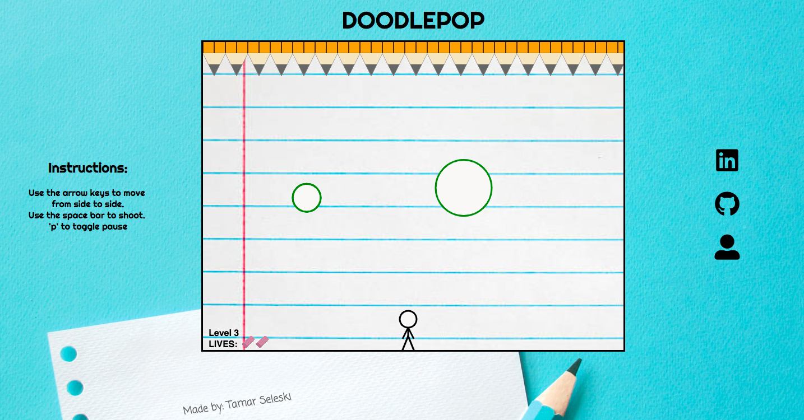

## DoodlePop

[Live Demo](http://tamarseleski.com/DoodlePop/)

### How to Play
DoodlePop is a clone of the classic flash game Bubble Trouble. The goal of the game is to pop the bubbles that are bouncing on the screen. Players control their character by using the left and right arrow keys to move and the spacebar to shoot the bubbles. If a player hits a bubble, it will either split into two smaller ones, or, if it is the smallest possible size, the bubble will pop. When all bubbles are popped, the player will advance to the next level.

### Built With

* JavaScript
* HTML5 Canvas
* CSS
